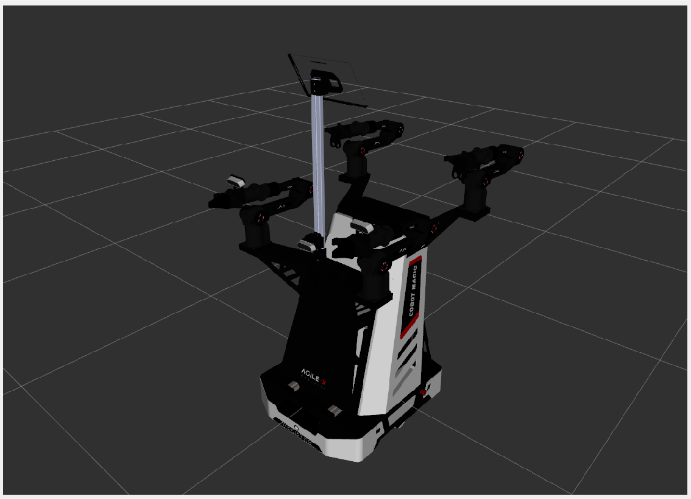

# FactoryMate — ROS 2 Jazzy + Gazebo Harmonic Dynamic Warehouse

This project is a **Gazebo Harmonic** / **ROS 2 Jazzy** simulation of the upstream dynamic logistics warehouse with the **Mobile ALOHA** robot. Generic primitive FactoryMate warehouse worlds, placeholder URDFs, and Isaac Sim backends are not included.

The default world is `dynamic_logistics_warehouse_harmonic.sdf`. The robot models live under `ros2_ws/src/mobile_aloha_sim/`.

## Demonstration



<video src="https://raw.githubusercontent.com/NikhileshRSahu/FactoryMate/main/assest/WhatsApp%20Video%202026-09-28%20at%2022.59.01.mp4" controls width="720"></video>

## What is included

- `factorymate_gazebo` ROS 2 ament package.
- Upstream Harmonic warehouse (`dynamic_logistics_warehouse_harmonic.sdf`).
- `mobile_aloha_sim` robot descriptions (default: `mobile_aloha_harmonic.urdf.xacro`).
- `ros_gz_bridge` mappings for clock, velocity / odometry / lidar, and Mobile ALOHA sensors.
- RViz2 configuration for TF, robot model, lidar, Nav2 plan, and costmap.
- Optional importer for `belal-ibrahim/dynamic_logistics_warehouse`.

## Required platform

Recommended target:

```text
Ubuntu 24.04
ROS 2 Jazzy
Gazebo Harmonic
ros_gz_sim
ros_gz_bridge
RViz2
colcon
```

Typical ROS packages are available from the ROS 2 Jazzy apt repository. The launcher checks dependencies and exits with an actionable message if one is missing.

## Run the Harmonic warehouse with Mobile ALOHA

From the project root:

```bash
./scripts/run_factorymate_gazebo.sh
```

Headless server mode:

```bash
./scripts/run_factorymate_gazebo.sh --headless --no-rviz
```

The default launch uses `dynamic_logistics_warehouse_harmonic.sdf` and `mobile_aloha_harmonic.urdf.xacro`.

## Use the original Dynamic Logistics Warehouse assets

The upstream binary meshes / textures are intentionally **not bundled** in this ZIP. Fetch and port them on the target machine:

```bash
./scripts/fetch_dynamic_logistics_assets.sh
./scripts/run_factorymate_gazebo.sh --upstream-world
```

The importer:

1. clones `belal-ibrahim/dynamic_logistics_warehouse`,
2. copies original models, meshes, and textures without modification,
3. preserves the original Classic `.world` as a source snapshot,
4. converts the world to SDF 1.10,
5. removes `libgazebo*` / `gazebo_ros*` Classic-only plugins,
6. adds Gazebo Harmonic Physics, UserCommands, SceneBroadcaster, and Sensors systems.

The original world contains its own scripted actors, so `--upstream-world` disables the native DiffDrive worker controller automatically.

## Spawn Mobile ALOHA

The default robot is Mobile ALOHA. Override the xacro path if needed:

```bash
./scripts/run_factorymate_gazebo.sh \
  --upstream-world \
  --robot-model ros2_ws/src/mobile_aloha_sim/aloha_new_description/urdf/mobile_aloha_harmonic.urdf.xacro \
  --robot-x 10.0 \
  --robot-y 10.0 \
  --robot-yaw 0.0
```

## ROS interfaces

Core bridge intent:

```text
/clock                    Gazebo -> ROS 2
/factorymate/cmd_vel      ROS 2  -> Gazebo
/factorymate/odom         Gazebo -> ROS 2
/factorymate/scan         Gazebo -> ROS 2
/workers/worker_XX/odom   Gazebo -> ROS 2
/workers/worker_XX/cmd_vel ROS 2 -> Gazebo
```

Higher-level Nav2 / CBF / ORCA / ACT systems should remain ROS-side and consume these simulator-independent interfaces.

## Validate the package

```bash
./scripts/validate_factorymate_harmonic.sh
```

The development suite checks SDF structure of `dynamic_logistics_warehouse_harmonic.sdf`, bridge directionality, launch contracts, asset migration behavior, Python syntax, and shell syntax. If `gz` is installed, the validator also asks sdformat to check the Harmonic world.

## Directory map

```text
factorymate_harmonic_complete/
├── ros2_ws/src/factorymate_gazebo/
│   ├── launch/
│   ├── worlds/   # dynamic_logistics_warehouse_harmonic.sdf
│   ├── config/
│   ├── rviz/
│   ├── models/
│   └── scripts/
├── ros2_ws/src/mobile_aloha_sim/
├── factorymate_gazebo_tools/
├── scripts/
├── tools/
├── tests/
└── docs/
```

## Important scope note

The target environment is the upstream Harmonic warehouse. The target robot is Mobile ALOHA under `ros2_ws/src/mobile_aloha_sim/`. Use `ros2 launch factorymate_gazebo mobile_aloha_gazebo.launch.py` for the full Mobile ALOHA spawn path.
